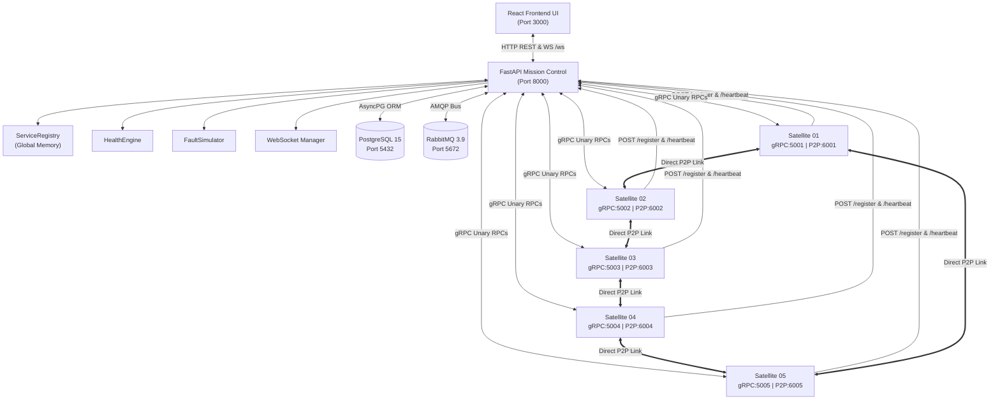
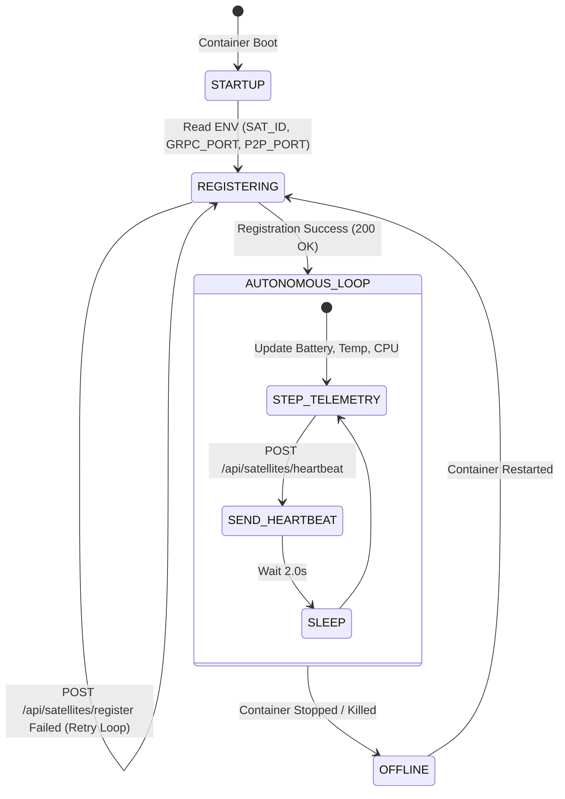
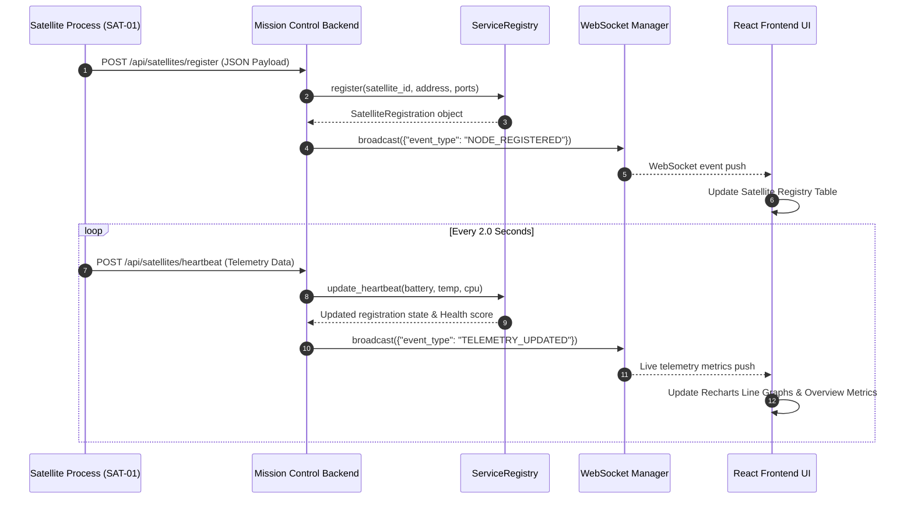
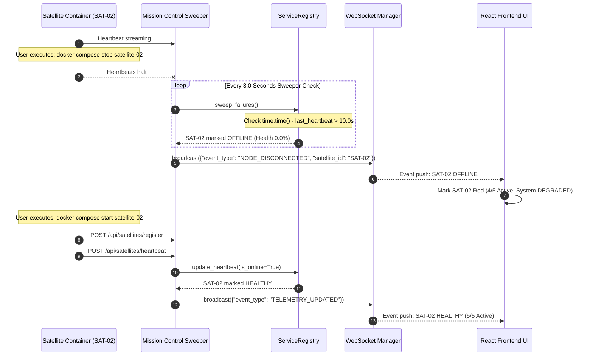

# System Architecture & Technical Design

A comprehensive architectural document detailing the multi-service design, message routing, data persistence, and software engineering patterns powering the **Distributed Satellite Monitoring & Mission Control System**.

---

## 1. Architectural Overview

The system is architected as a set of autonomous containerized microservices operating over a virtualized bridge network. It consists of:
- **1 Mission Control Orchestrator**: FastAPI application hosting the dynamic Service Registry, Health Engine, Fault Simulator, gRPC manager, RabbitMQ consumer, WebSocket stream broadcaster, and database ORM.
- **5 Satellite Microservice Nodes (`SAT-01` to `SAT-05`)**: Autonomous Python processes executing independent telemetry steps, issuing periodic heartbeats, running gRPC servers, and handling direct peer-to-peer (P2P) cross-links.
- **1 Real-Time Frontend Observability UI**: React 18 / Vite single-page application consuming REST endpoints and WebSocket events.
- **2 Supporting Infrastructure Services**: PostgreSQL database for event persistence and RabbitMQ message broker for asynchronous telemetry queue management.

---

## 2. Problem-to-Architecture Mapping

| Distributed System Problem | Architectural Solution | Implementation Component | Source File Reference |
| :--- | :--- | :--- | :--- |
| **Independent Satellite Autonomy** | Autonomous microservice processes | `SatelliteNode` | [`satellites/satellite_node.py`](../satellites/satellite_node.py) |
| **Dynamic Service Discovery** | In-memory dynamic registry | `SatelliteRegistry` | [`backend/registry/service_registry.py`](../backend/registry/service_registry.py) |
| **Liveness & Crash Detection** | Heartbeat sweeper (10.0s TTL) | `heartbeat_sweeper_task()` | [`backend/main.py`](../backend/main.py#L34-L53) |
| **Multi-Metric Health Evaluation** | Weighted telemetry scoring algorithm | `HealthEngine` | [`backend/services/health_engine.py`](../backend/services/health_engine.py) |
| **Control Action Remote Invocations** | Binary Protocol Buffers over gRPC | `GRPCClientManager` | [`backend/communication/grpc_client.py`](../backend/communication/grpc_client.py) |
| **Asynchronous Telemetry Ingestion** | RabbitMQ AMQP message broker | `RabbitMQManager` | [`backend/communication/rabbitmq_manager.py`](../backend/communication/rabbitmq_manager.py) |
| **Live UI Telemetry Streaming** | WebSocket broadcast manager | `ConnectionManager` | [`backend/communication/websocket_manager.py`](../backend/communication/websocket_manager.py) |
| **Inter-Satellite Cross-Links** | Direct P2P HTTP/TCP messaging | `send_to_peer` trigger | [`satellites/satellite_node.py`](../satellites/satellite_node.py#L225-L260) |
| **Distributed Consensus / Coordination** | Ring Leader Election algorithm | `run_ring_election()` | [`backend/registry/service_registry.py`](../backend/registry/service_registry.py#L140-L195) |
| **Environment Isolation** | Docker Compose multi-container setup | 9 Docker services | [`docker-compose.yml`](../docker-compose.yml) |

---

## 3. High-Level Architecture Diagram

---

## 4. Distributed Nodes Description

### Mission Control Backend (`mission-control-backend`)
- **Host**: `mission-control:8000` (Docker container name)
- **Role**: Coordinates constellation liveness, processes heartbeats, exposes REST endpoints, manages WebSockets broadcasts, persists logs to PostgreSQL, and ingests RabbitMQ telemetry messages.

### Satellite Microservice Nodes (`satellite-01` .. `satellite-05`)
- **Containers**: `satellite-01`, `satellite-02`, `satellite-03`, `satellite-04`, `satellite-05`
- **Network Ports**:
  - `SAT-01`: gRPC `5001`, P2P `6001`
  - `SAT-02`: gRPC `5002`, P2P `6002`
  - `SAT-03`: gRPC `5003`, P2P `6003`
  - `SAT-04`: gRPC `5004`, P2P `6004`
  - `SAT-05`: gRPC `5005`, P2P `6005`
- **Responsibilities**:
  1. Execute local telemetry stepping algorithm every 2 seconds.
  2. Issue HTTP registration and heartbeat requests to Mission Control.
  3. Host async gRPC servicer implementing `proto/satellite.proto`.
  4. Host async HTTP P2P listener for direct peer communication.

---

## 5. Frontend Architecture

The frontend is built using React 18 and Vite, structured into modular pages:
- **`MissionOverview.jsx`**: Summary metrics, healthy satellite counters, and live constellation node table.
- **`SatelliteRegistryPage.jsx`**: Dynamic discovery lookup table displaying hostnames, ports, and capabilities.
- **`LiveTelemetryPage.jsx`**: Recharts time-series line charts for Battery, Temperature, CPU, and Health Score metrics.
- **`CommunicationObservatory.jsx`**: Multi-protocol evidence inspector for gRPC, RabbitMQ, WebSockets, P2P, and WebRTC.
- **`ConstellationMap.jsx`**: Visual orbital topology canvas highlighting active nodes and P2P links.
- **`FaultSimulatorPage.jsx`**: Fault injection triggers and active fault management table.
- **`App.jsx`**: Top-level router, central WebSocket listener, and rolling telemetry history accumulator.

---

## 6. Backend Architecture

The backend is built with FastAPI and Uvicorn, structured as follows:
- **`backend/main.py`**: Lifespan initializer, route definitions, and background sweeper task.
- **`backend/registry/service_registry.py`**: In-memory `SatelliteRegistry` data structure and `run_ring_election()`.
- **`backend/services/health_engine.py`**: Pure functional metric scorer (`calculate_health()`).
- **`backend/communication/grpc_client.py`**: Async gRPC client wrapper invoking `SatelliteService` RPC methods.
- **`backend/communication/rabbitmq_manager.py`**: Async AMQP client managing connection, exchange declaration, and message listening.
- **`backend/communication/websocket_manager.py`**: Thread-safe WebSocket connection pool (`ConnectionManager`).
- **`backend/faults/fault_simulator.py`**: In-memory fault state tracker (`FaultSimulator`).
- **`backend/database/`**: SQLAlchemy async session manager and PostgreSQL models.

---

## 7. Satellite Node Lifecycle

---

## 8. Database Architecture

Persistent storage is managed by PostgreSQL 15 via SQLAlchemy async ORM (`backend/database/models.py`):
1. **`SatelliteModel` (`satellites`)**: Persistent snapshot of satellite registration state and telemetry.
2. **`TelemetryLog` (`telemetry_logs`)**: Time-series log of satellite metric samples.
3. **`CommunicationEvent` (`communication_events`)**: Audit log for RPCs, RabbitMQ messages, P2P transfers, and election events.
4. **`FaultInjectionLog` (`fault_logs`)**: Historical record of injected fault events.
5. **`ConceptEvidence` (`concept_evidences`)**: Audit trail mapping executed operations to syllabus topics.

---

## 9. End-to-End Data Flow

---

## 10. Failure and Recovery Flow

---

## 11. Component-to-File Mapping

| Architectural Component | Class / Function | Source File Path | Primary Responsibility |
| :--- | :--- | :--- | :--- |
| **Mission Control API** | `FastAPI()` application | [`backend/main.py`](../backend/main.py) | Lifespan, REST endpoints, WebSocket endpoint `/ws` |
| **Service Registry** | `SatelliteRegistry` | [`backend/registry/service_registry.py`](../backend/registry/service_registry.py) | Endpoint lookup, TTL failure sweep, Ring election |
| **Health Engine** | `HealthEngine` | [`backend/services/health_engine.py`](../backend/services/health_engine.py) | Weighted 0-100% health calculation formula |
| **Fault Simulator** | `FaultSimulator` | [`backend/faults/fault_simulator.py`](../backend/faults/fault_simulator.py) | Anomaly injection and fault state management |
| **gRPC Client Manager** | `GRPCClientManager` | [`backend/communication/grpc_client.py`](../backend/communication/grpc_client.py) | Async gRPC stubs for satellite RPC invocations |
| **RabbitMQ Manager** | `RabbitMQManager` | [`backend/communication/rabbitmq_manager.py`](../backend/communication/rabbitmq_manager.py) | AMQP connection, exchange binding, message listener |
| **WebSocket Manager** | `ConnectionManager` | [`backend/communication/websocket_manager.py`](../backend/communication/websocket_manager.py) | WebSocket connection pooling and event broadcasting |
| **WebRTC Manager** | `WebRTCManager` | [`backend/communication/webrtc_signaling.py`](../backend/communication/webrtc_signaling.py) | SDP offer/answer processing and ICE candidate handling |
| **Satellite Microservice** | `SatelliteNode` | [`satellites/satellite_node.py`](../satellites/satellite_node.py) | Independent satellite logic, heartbeats, gRPC server |
| **Protobuf Contract** | `SatelliteService` | [`proto/satellite.proto`](../proto/satellite.proto) | gRPC message definitions and RPC service interface |
| **Database ORM** | `Base` models | [`backend/database/models.py`](../backend/database/models.py) | PostgreSQL schema definitions for audit logging |
