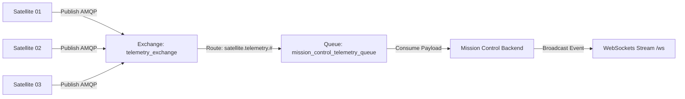
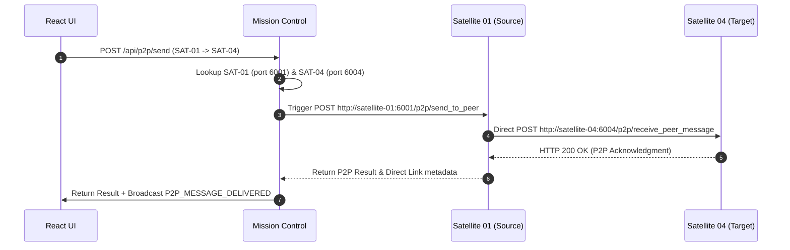
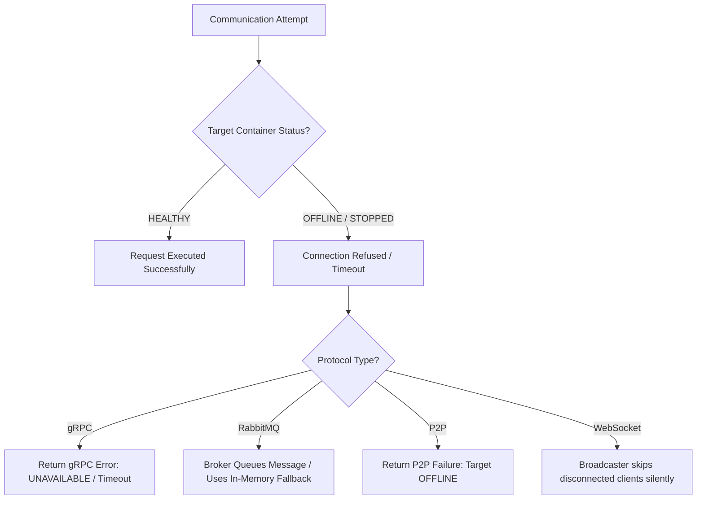

# Multi-Protocol Communication Architecture

A comprehensive technical guide to the 5 communication paradigms implemented in the **Distributed Satellite Monitoring System**: gRPC Protocol Buffers, RabbitMQ AMQP messaging, WebSockets real-time streaming, Direct Peer-to-Peer (P2P) cross-links, and WebRTC signaling.

---

## 1. Communication Overview

To simulate real-world aerospace constellation requirements, Mission Control uses distinct communication protocols tailored for specific interactions:
- **Control Actions & Diagnostics**: Synchronous gRPC binary RPCs.
- **Telemetry Processing**: Asynchronous RabbitMQ AMQP queue ingestion.
- **Live User Interface Updates**: Real-time push over WebSockets `/ws`.
- **Inter-Satellite Cross-Links**: Direct satellite-to-satellite HTTP/TCP P2P.
- **Real-Time Stream Channels**: WebRTC peer connection signaling.

---

## 2. Multi-Protocol Communication Matrix

| Protocol / Mechanism | Sender | Receiver | Transport / Format | Purpose | Sync / Async | Implementation Location |
| :--- | :--- | :--- | :--- | :--- | :--- | :--- |
| **gRPC / Protobuf** | Mission Control | Satellite Containers | HTTP/2 Binary Protobuf | Command execution & RPC health queries | Synchronous | [`backend/communication/grpc_client.py`](../backend/communication/grpc_client.py) |
| **RabbitMQ AMQP** | Satellite Nodes | Mission Control | AMQP 0-9-1 JSON | Decoupled telemetry stream queuing | Asynchronous | [`backend/communication/rabbitmq_manager.py`](../backend/communication/rabbitmq_manager.py) |
| **WebSockets** | Mission Control | React Frontend | WSS JSON Text | Push live state & telemetry updates to UI | Asynchronous Push | [`backend/communication/websocket_manager.py`](../backend/communication/websocket_manager.py) |
| **Direct P2P Cross-Link** | Source Satellite | Target Satellite | HTTP/1.1 JSON | Inter-satellite cross-track data exchange | Synchronous | [`satellites/satellite_node.py`](../satellites/satellite_node.py#L225-L260) |
| **WebRTC Signaling** | Mission Control | Browser Client | WebSockets / JSON SDP | Establish P2P WebRTC data/media streams | Asynchronous | [`backend/communication/webrtc_signaling.py`](../backend/communication/webrtc_signaling.py) |
| **HTTP Heartbeats** | Satellite Nodes | Mission Control | HTTP/1.1 REST | Dynamic registration & liveness updates | Periodic (2.0s) | [`satellites/satellite_node.py`](../satellites/satellite_node.py#L132-L152) |

---

## 3. Remote Procedure Calls (gRPC / Protobuf)

### Architecture & Service Contract
gRPC provides high-performance unary remote procedure calls defined in [`proto/satellite.proto`](../proto/satellite.proto).

#### Proto Service Definition:
```protobuf
service SatelliteService {
  rpc GetHealth(HealthRequest) returns (HealthResponse);
  rpc GetTelemetry(TelemetryRequest) returns (TelemetryResponse);
  rpc GetSatelliteInfo(InfoRequest) returns (InfoResponse);
  rpc Ping(PingRequest) returns (PingResponse);
  rpc ExecuteCommand(CommandRequest) returns (CommandResponse);
  rpc SendP2PMessage(P2PRequest) returns (P2PResponse);
}
```

### Request / Response Execution Flow
1. User triggers RPC invocation on the Communication Observatory (`/observatory`) UI.
2. React issues `POST /api/rpc/invoke` payload `{ "target_satellite_id": "SAT-01", "method": "GetHealth" }`.
3. `GRPCClientManager` looks up target address (`satellite-01:5001`) from `SatelliteRegistry`.
4. Client constructs async gRPC channel and invokes `stub.GetHealth(request)`.
5. Satellite container processes request and returns binary `HealthResponse`.
6. Mission Control logs latency (ms) to PostgreSQL and broadcasts `RPC_EXECUTED` event via WebSockets.

---

## 4. Message-Oriented Communication (RabbitMQ AMQP)

### Broker & Queue Topology
- **Host**: `satellite-rabbitmq:5672` (Management console on `:15672`).
- **Exchange**: `telemetry_exchange` (Topic Exchange).
- **Routing Key**: `satellite.telemetry.#`.
- **Consumer Queue**: `mission_control_telemetry_queue`.



---

## 5. Stream-Oriented Communication (WebSockets)

### Real-Time Broadcast Architecture
FastAPI handles full-duplex WebSocket connections at `@app.websocket("/ws")`. Connections are managed by `ConnectionManager` ([`backend/communication/websocket_manager.py`](../backend/communication/websocket_manager.py)).

#### Broadcast Event Payload Types:
1. **`TELEMETRY_UPDATED`**: Emitted on every heartbeat and AMQP ingestion, transmitting real-time battery, temp, CPU, and health score values.
2. **`NODE_REGISTERED`**: Emitted when a new satellite registers with `SatelliteRegistry`.
3. **`NODE_DISCONNECTED`**: Emitted when the 10.0s TTL sweeper marks a satellite `OFFLINE`.
4. **`FAULT_INJECTED` / `FAULTS_CLEARED`**: Emitted when faults are modified.
5. **`LEADER_ELECTION_COMPLETED`**: Emitted when Ring election produces a new leader.

---

## 6. Direct Peer-to-Peer Cross-Links (P2P)

### Direct Node Communication Architecture
Satellites communicate directly without relaying payload data through Mission Control.



---

## 7. WebRTC Signaling Architecture

WebRTC signaling is handled by `WebRTCManager` ([`backend/communication/webrtc_signaling.py`](../backend/communication/webrtc_signaling.py)):
- **Offer / Answer Exchange**: `POST /api/webrtc/offer` stores client SDP offers and returns simulated SDP answers.
- **ICE Candidate Trickling**: `POST /api/webrtc/ice-candidate` accepts network candidates to establish peer channels.

---

## 8. Protocol Comparison Matrix

| Aspect | gRPC | RabbitMQ | WebSockets | Direct P2P | WebRTC |
| :--- | :--- | :--- | :--- | :--- | :--- |
| **Primary Use Case** | Diagnostics & Commands | Telemetry Log Queuing | Live UI Stream | Inter-Satellite Data | Real-Time Peer Channels |
| **Transport Protocol** | HTTP/2 | TCP (AMQP) | TCP (WSS) | HTTP/1.1 TCP | UDP / ICE / DTLS |
| **Data Format** | Protobuf Binary | JSON Text | JSON Text | JSON Text | Binary / DataChannel |
| **Coupling** | Direct Client-Server | Decoupled (Broker) | Client-Server Push | Node-to-Node | Peer-to-Peer |
| **Latency** | Extremely Low (~2-5ms) | Low (~5-10ms) | Instantaneous (~1ms) | Very Low (~3-8ms) | Real-time (<1ms) |

---

## 9. Failure Scenarios & System Behavior


