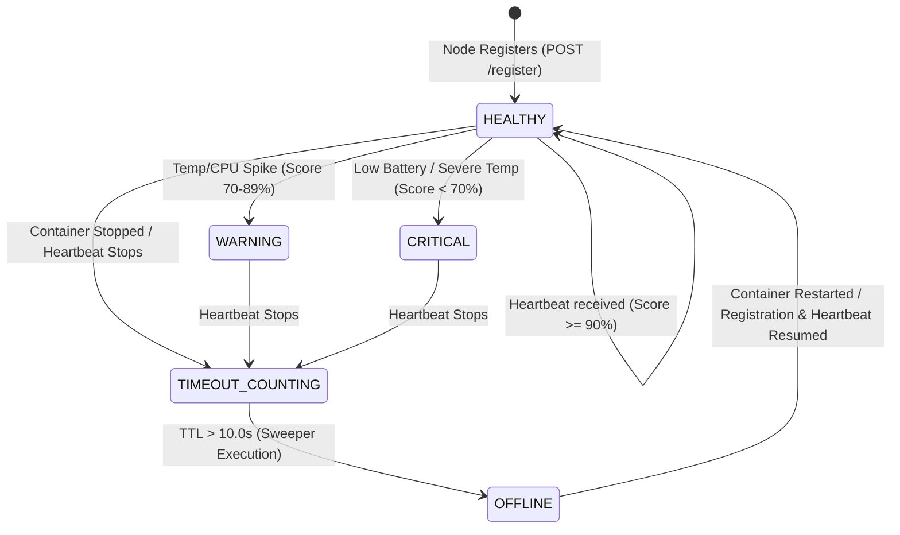
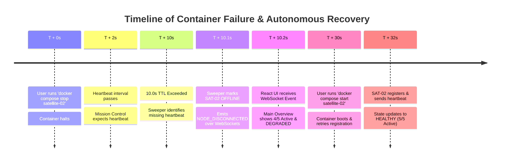

# Fault Tolerance, Failure Detection & Autonomous Recovery

A comprehensive reference on the resilience mechanisms, heartbeat TTL failure detectors, health scoring formulas, and controlled fault injection engines powering the **Distributed Satellite Monitoring System**.

---

## 1. Fault Tolerance Overview

In orbital satellite constellations, physical access for hardware repair is impossible. System resilience must be achieved strictly through software-defined fault detection, heartbeat liveness monitoring, graceful degradation, and autonomous re-registration.

The system addresses partial failure by ensuring that node crashes, network latency, or sensor degradation on any individual satellite (`SAT-01`..`SAT-05`) never lock up Mission Control backend execution or corrupt system state.

---

## 2. Supported Failure Types

| Failure Type | Real-World Analog | Simulation Mechanism | System Reaction |
| :--- | :--- | :--- | :--- |
| **Crash-Stop Failure** | Spacecraft power loss or total system crash | `docker compose stop satellite-02` or `STOP_NODE` fault | Heartbeat stops; 10.0s TTL sweeper marks node `OFFLINE`. |
| **Transient Latency** | Solar storm solar flair radio interference | `HIGH_LATENCY` fault injection | P2P and RPC calls introduce artificial sleep delays. |
| **Packet Loss** | Antenna misalignment | `PACKET_LOSS` fault injection | Simulates dropped P2P cross-link messages. |
| **Sensor Degradation** | Battery degradation or radiator failure | `TEMP_SPIKE` or `BATTERY_DRAIN` fault | `HealthEngine` drops health score to `CRITICAL` (<70%). |
| **CPU Overload** | Processing loop deadlock | `CPU_OVERLOAD` fault | `HealthEngine` drops health score to `WARNING` (<90%). |

---

## 3. Heartbeat Mechanics & Liveness Monitoring

Each satellite microservice runs an autonomous telemetry loop transmitting periodic heartbeats to Mission Control.

- **Heartbeat Transmission Frequency**: Every `2.0 seconds`.
- **Endpoint**: `POST /api/satellites/heartbeat`.
- **Payload Contents**: `satellite_id`, `node_id`, `battery`, `temperature`, `cpu_usage`, `memory_usage`, `signal_strength`, `grpc_port`, `p2p_port`.
- **Source Location**: `send_heartbeat()` in [`satellites/satellite_node.py`](../satellites/satellite_node.py#L132-L152).

---

## 4. Heartbeat TTL Sweeper & Failure Detector

Mission Control runs an asynchronous background task enforcing a **10.0-second Time-To-Live (TTL)** liveness contract.

- **Sweeper Task**: `heartbeat_sweeper_task()` in [`backend/main.py`](../backend/main.py#L34-L53).
- **Sweep Interval**: Scans every `3.0 seconds`.
- **Timeout Threshold**: `10.0 seconds` (`settings.HEARTBEAT_TIMEOUT_SECONDS`).
- **Failure Logic**:
  ```python
  now = time.time()
  if reg.status != "OFFLINE" and (now - reg.last_heartbeat) > 10.0:
      reg.status = "OFFLINE"
      reg.health_score = 0.0
  ```

---

## 5. Registry State Transition Diagram



---

## 6. Multi-Metric Health Engine Scorer

The `HealthEngine` ([`backend/services/health_engine.py`](../backend/services/health_engine.py)) computes a composite health score from `0.0` to `100.0%`:

$$\text{Health Score} = S_{\text{battery}} + S_{\text{temp}} + S_{\text{cpu}} + S_{\text{memory}} + S_{\text{signal}}$$

### Metric Weight Breakdown:
1. **Battery Level (25% Weight)**: Optimal $\ge 70\%$ ($25.0$ pts). Below $30\%$, linear drop to $0$.
2. **Core Temperature (25% Weight)**: Optimal $15^\circ\text{C}$ to $45^\circ\text{C}$ ($25.0$ pts). Drops linearly above $45^\circ\text{C}$.
3. **CPU Usage (20% Weight)**: Optimal $\le 70\%$ ($20.0$ pts). Drops above $70\%$.
4. **Memory Usage (15% Weight)**: Optimal $\le 80\%$ ($15.0$ pts). Drops above $80\%$.
5. **Signal Strength (15% Weight)**: Optimal $\ge 60\%$ ($15.0$ pts). Drops below $60\%$.

#### Status Classification:
- `90.0% - 100.0%`: **`HEALTHY`**
- `70.0% - 89.9%`: **`WARNING`**
- `< 70.0%`: **`CRITICAL`**
- Unreachable / TTL Exceeded: **`OFFLINE`** ($0.0\%$)

---

## 7. Controlled Fault Injection Engine

The `FaultSimulator` ([`backend/faults/fault_simulator.py`](../backend/faults/fault_simulator.py)) allows operators to inject anomalies dynamically from the UI (`/faults`):

```python
# Injected Fault Types in FaultSimulator:
1. STOP_NODE      # Forces satellite status to OFFLINE and health to 0.0%
2. RESTART_NODE   # Resets satellite status to HEALTHY and health to 100.0%
3. HIGH_LATENCY   # Introduces sleep delay (ms) on P2P/RPC requests
4. PACKET_LOSS    # Simulates message drops on inter-satellite links
5. TEMP_SPIKE     # Forces core temperature to 85°C (Status: CRITICAL)
6. BATTERY_DRAIN  # Forces battery charge to 15% (Status: CRITICAL)
7. CPU_OVERLOAD   # Forces CPU utilization to 98% (Status: WARNING)
```

---

## 8. Failure Detection & Propagation Timeline



---

## 9. Failure & Recovery Demonstration Procedure

### 1. Execute Node Failure:
```powershell
docker compose stop satellite-02
```
- **Backend Log**: `[FAILURE DETECTOR] Satellite SAT-02 heartbeat timed out! Status marked OFFLINE.`
- **Frontend State**: Main Overview displays `Healthy Satellites: 4 / 5`, `System: DEGRADED`. Satellite Registry table displays red `OFFLINE` badge.

### 2. Execute Node Recovery:
```powershell
docker compose start satellite-02
```
- **Backend Log**: `Registered Satellite SAT-02 at satellite-02:5002` followed by HTTP `200 OK` heartbeats.
- **Frontend State**: Automatically recovers to `Healthy Satellites: 5 / 5` and `System: HEALTHY`.
