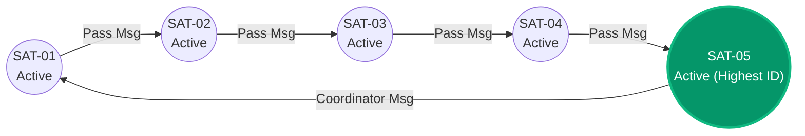
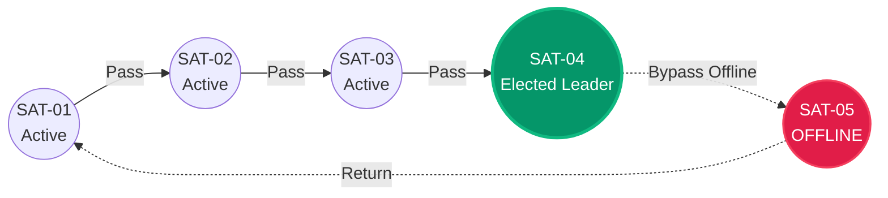

# Ring-Based Leader Election & Consensus

A technical reference detailing the **Ring Leader Election** algorithm, consensus topology, trace logs, and execution mechanics in the **Distributed Satellite Monitoring System**.

---

## 1. Purpose & Overview

In a distributed satellite constellation, coordinate tasks (such as orbit adjustment synchronization, bulk payload transmission to ground stations, or cross-track schedule resolution) require a designated **Leader / Coordinator Node**.

The system implements a **Ring Leader Election Algorithm (Highest Node ID Wins)** in [`backend/registry/service_registry.py`](../backend/registry/service_registry.py#L140-L195). It dynamically traverses the active logical ring, bypasses dead nodes marked `OFFLINE`, and elects the active satellite node with the highest lexicographical identifier (`SAT-05` nominally).

---

## 2. Why Leader Election is Needed

1. **Avoid Centralized Single Point of Failure**: If a ground station loses connectivity, satellite nodes must autonomously agree on a coordinator node.
2. **Prevent Split-Brain Decisions**: Ensures exactly one coordinator node issues constellation-wide synchronization commands.
3. **Dynamic Fault Recovery**: If the current leader (`SAT-05`) crashes, a re-election automatically promotes the highest surviving node (`SAT-04`).

---

## 3. Logical Ring Topology

The constellation nodes form a logical unidirectional ring:

$$\text{SAT-01} \longrightarrow \text{SAT-02} \longrightarrow \text{SAT-03} \longrightarrow \text{SAT-04} \longrightarrow \text{SAT-05} \longrightarrow \text{SAT-01}$$

---

## 4. Ring Election Algorithm



### Algorithm Steps:
1. **Initiation**: Any active node or operator triggers an election (e.g. initiated by `SAT-01`).
2. **Ring Path Calculation**: The initiator constructs an ordered ring traversal starting from itself.
3. **Liveness Evaluation**: For each node in the ring, the algorithm checks `SatelliteRegistry`:
   - If node is **`HEALTHY` / Active**: Append node to `visited_active` list and log step `PASSED_ELECTION_MSG`.
   - If node is **`OFFLINE`**: Append node to `bypassed_failed` list and log step `NODE_OFFLINE_BYPASSED`.
4. **Leader Selection**: The winner is selected as $\text{Winner} = \max(\text{visited\_active})$.
5. **Coordinator Announcement**: Mission Control updates `global_registry.current_leader = winner` and broadcasts a `LEADER_ELECTION_COMPLETED` event over WebSockets.

---

## 5. Implementation Code Breakdown

### Source Location:
- **Class**: `SatelliteRegistry` in [`backend/registry/service_registry.py`](../backend/registry/service_registry.py#L140-L195)
- **API Endpoint**: `POST /api/election/ring?initiator_id=SAT-01` in [`backend/main.py`](../backend/main.py#L394-L417)

```python
def run_ring_election(self, initiator_id: str = "SAT-01") -> Dict[str, Any]:
    start_time = time.time()
    all_ring_nodes = ["SAT-01", "SAT-02", "SAT-03", "SAT-04", "SAT-05"]
    
    start_idx = all_ring_nodes.index(initiator_id)
    ordered_ring = all_ring_nodes[start_idx:] + all_ring_nodes[:start_idx]

    visited_active = []
    bypassed_failed = []
    election_trace = []

    for node_id in ordered_ring:
        reg = self._registry.get(node_id)
        is_active = reg and reg.status != "OFFLINE"
        
        if is_active:
            visited_active.append(node_id)
            election_trace.append({
                "step": len(election_trace) + 1,
                "from_node": visited_active[-2] if len(visited_active) > 1 else initiator_id,
                "to_node": node_id,
                "action": "PASSED_ELECTION_MSG",
                "highest_candidate": max(visited_active),
                "timestamp": round(time.time(), 3)
            })
        else:
            bypassed_failed.append(node_id)
            election_trace.append({
                "step": len(election_trace) + 1,
                "node": node_id,
                "action": "NODE_OFFLINE_BYPASSED",
                "timestamp": round(time.time(), 3)
            })

    winner = max(visited_active) if visited_active else "NONE"
    self.current_leader = winner
    return {
        "status": "SUCCESS",
        "protocol": "Ring Leader Election (Highest ID Wins)",
        "initiator": initiator_id,
        "current_leader": winner,
        "participating_nodes": visited_active,
        "failed_nodes": bypassed_failed,
        "election_trace": election_trace
    }
```

---

## 6. Execution Trace Example (Nominal Case)

When all 5 satellites are `HEALTHY`, triggering `POST /api/election/ring?initiator_id=SAT-01` produces:

```json
{
  "event_id": "EVT-ELECT-1772518400000",
  "status": "SUCCESS",
  "protocol": "Ring Leader Election (Highest ID Wins)",
  "initiator": "SAT-01",
  "current_leader": "SAT-05",
  "ring_topology": "SAT-01 -> SAT-02 -> SAT-03 -> SAT-04 -> SAT-05 -> SAT-01",
  "participating_nodes": ["SAT-01", "SAT-02", "SAT-03", "SAT-04", "SAT-05"],
  "failed_nodes": [],
  "latency_ms": 0.15
}
```

---

## 7. Re-Election under Failure Scenarios

### Scenario: `SAT-05` Container Stopped (`docker compose stop satellite-05`)
1. 10.0s TTL sweeper detects missing heartbeat and marks `SAT-05` `OFFLINE`.
2. Operator triggers election: `POST /api/election/ring?initiator_id=SAT-01`.
3. Election message traverses `SAT-01 ➔ SAT-02 ➔ SAT-03 ➔ SAT-04`.
4. Message reaches `SAT-05`; sweeper flags `SAT-05` as `NODE_OFFLINE_BYPASSED`.
5. Highest candidate among active nodes is `SAT-04`.
6. `SAT-04` is elected new leader (`current_leader: SAT-04`).



---

## 8. Frontend Visualization

The election trace is rendered on the **Communication Observatory** page (`/observatory`) using the `ExecutionTrace.jsx` component:
- Displays visual step-by-step ring message passing.
- Highlights active nodes in cyan/emerald and bypassed offline nodes in red.
- Displays the elected leader banner (`NEW LEADER ELECTED: SAT-05`).
