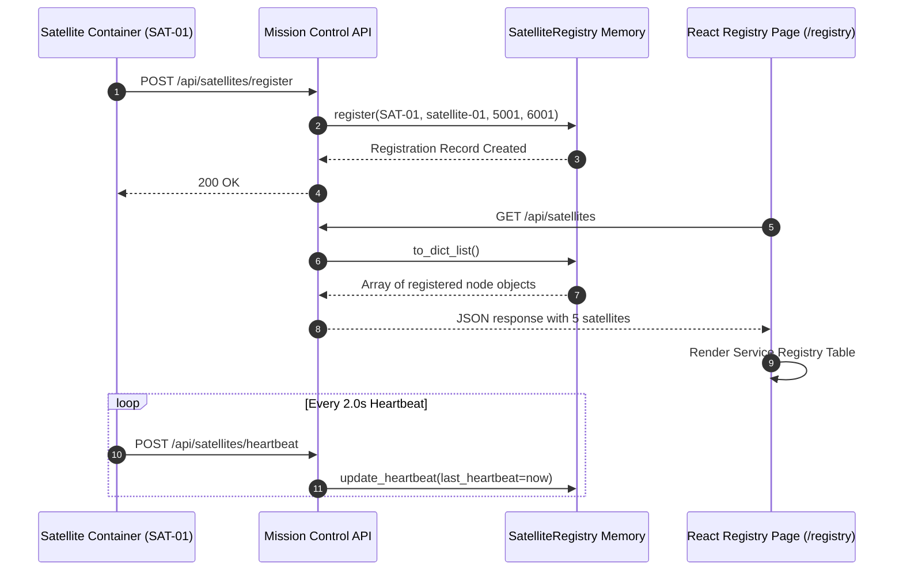

# Dynamic Service Registry & Naming Discovery

A technical architectural document explaining dynamic endpoint discovery, satellite registration, liveness lookup tables, and naming conventions in the **Distributed Satellite Monitoring System**.

---

## 1. Purpose & Overview

In a containerized distributed system, hardcoding static IP addresses or fixed ports leads to fragile deployments that break when containers restart or move across host machines. 

The **Satellite Service Registry** ([`backend/registry/service_registry.py`](../backend/registry/service_registry.py)) provides a centralized, dynamic naming and lookup service. It allows satellite microservices (`SAT-01`..`SAT-05`) to register their network locations at boot time and enables Mission Control and client applications to discover active RPC/P2P endpoints dynamically.

---

## 2. Why Dynamic Discovery is Needed

1. **Container Network Isolation**: Docker Compose assigns dynamic IP addresses on the bridge network (`ds-project_default`).
2. **Endpoint Mapping**: Microservices expose distinct gRPC ports (`5001-5005`) and P2P cross-link ports (`6001-6005`).
3. **Decoupled Cross-Links**: When `SAT-01` sends a direct P2P message to `SAT-04`, Mission Control queries `SatelliteRegistry` for `SAT-04`'s address and P2P port rather than using hardcoded values.
4. **Liveness Tracking**: The registry maintains dynamic status (`HEALTHY`, `WARNING`, `CRITICAL`, `OFFLINE`) reconciled by incoming heartbeats.

---

## 3. Naming & Identifiers

| Naming Dimension | Field Name | Example Value | Description |
| :--- | :--- | :--- | :--- |
| **Satellite ID** | `satellite_id` | `SAT-01` | Human-readable primary key for constellation node. |
| **Internal Node ID** | `node_id` | `NODE-SAT-01-3325` | Unique runtime process identifier containing instance hash. |
| **Hostname** | `hostname` | `sat-01.orbital.local` | FQDN representation on the orbital grid. |
| **Network Address** | `address` | `satellite-01` | Docker Compose DNS bridge network hostname. |
| **gRPC Endpoint** | `grpc_port` | `5001` | Network port for binary Protobuf remote calls. |
| **P2P Endpoint** | `p2p_port` | `6001` | Network port for direct inter-satellite cross-links. |
| **Capabilities** | `capabilities` | `["TELEMETRY", "gRPC", "P2P", "RABBITMQ", "WEBRTC"]` | Supported protocols and microservice features. |

---

## 4. Service Registration Flow

When a satellite container boots, `SatelliteNode.start_autonomous_loop()` invokes `register_with_mission_control()`:

```python
# Payload sent from SatelliteNode to POST /api/satellites/register
{
    "satellite_id": "SAT-01",
    "node_id": "NODE-SAT-01-3325",
    "hostname": "sat-01.orbital.local",
    "address": "satellite-01",
    "grpc_port": 5001,
    "p2p_port": 6001,
    "capabilities": ["TELEMETRY", "gRPC", "P2P", "RABBITMQ", "WEBRTC"]
}
```

### Registration Retry Loop:
To eliminate Docker Compose startup race conditions (where satellite containers boot slightly faster than FastAPI database initialization), satellites execute a background retry loop:

```python
async def start_autonomous_loop(self):
    while not getattr(self, 'is_registered', False):
        success = await self.register_with_mission_control()
        if not success:
            await asyncio.sleep(2.0)
    # Proceed to telemetry heartbeat loop
```

---

## 5. Registry Data Model

The in-memory registry is backed by the `SatelliteRegistration` dataclass in [`backend/registry/service_registry.py`](../backend/registry/service_registry.py):

```python
@dataclass
class SatelliteRegistration:
    satellite_id: str
    node_id: str
    hostname: str
    address: str
    grpc_port: int
    p2p_port: int
    status: str                       # HEALTHY, WARNING, CRITICAL, OFFLINE
    capabilities: List[str]
    last_heartbeat: float             # Epoch timestamp
    registered_at: float
    health_score: float = 100.0
    battery: float = 100.0
    temperature: float = 25.0
    cpu_usage: float = 15.0
    memory_usage: float = 30.0
    signal_strength: float = 95.0
```

---

## 6. Service Discovery REST APIs

### 1. `POST /api/satellites/register`
Registers a satellite node or updates its existing registration metadata. Returns `200 OK` with the registration record.

### 2. `GET /api/satellites`
Returns the full discovery lookup array consumed by the frontend:
```json
{
  "count": 5,
  "satellites": [
    {
      "satellite_id": "SAT-01",
      "node_id": "NODE-SAT-01-3325",
      "hostname": "sat-01.orbital.local",
      "address": "satellite-01",
      "grpc_port": 5001,
      "p2p_port": 6001,
      "status": "HEALTHY",
      "health_score": 95.14,
      "battery": 95.14,
      "temperature": 30.87,
      "cpu_usage": 8.5,
      "seconds_since_heartbeat": 0.45,
      "capabilities": ["TELEMETRY", "gRPC", "P2P", "RABBITMQ", "WEBRTC"]
    }
  ]
}
```

### 3. `GET /api/satellites/{satellite_id}`
Lookup endpoint returning details for a single target satellite node.

---

## 7. Frontend Service Discovery Table

The frontend renders the dynamic lookup table on the **Satellite Service Registry** page (`/registry`):

| Satellite ID | Internal Node ID | Hostname | Address | gRPC Endpoint | P2P Endpoint | Status | Last Heartbeat | Capabilities |
| :--- | :--- | :--- | :--- | :--- | :--- | :--- | :--- | :--- |
| **SAT-01** | NODE-SAT-01-3325 | sat-01.orbital.local | satellite-01 | `:5001` | `:6001` | `HEALTHY` | 0.4s ago | TELEMETRY, gRPC, P2P, RABBITMQ, WEBRTC |
| **SAT-02** | NODE-SAT-02-7706 | sat-02.orbital.local | satellite-02 | `:5002` | `:6002` | `HEALTHY` | 0.2s ago | TELEMETRY, gRPC, P2P, RABBITMQ, WEBRTC |
| **SAT-03** | NODE-SAT-03-9244 | sat-03.orbital.local | satellite-03 | `:5003` | `:6003` | `HEALTHY` | 1.9s ago | TELEMETRY, gRPC, P2P, RABBITMQ, WEBRTC |
| **SAT-04** | NODE-SAT-04-9158 | sat-04.orbital.local | satellite-04 | `:5004` | `:6004` | `HEALTHY` | 1.9s ago | TELEMETRY, gRPC, P2P, RABBITMQ, WEBRTC |
| **SAT-05** | NODE-SAT-05-3203 | sat-05.orbital.local | satellite-05 | `:5005` | `:6005` | `HEALTHY` | 0.4s ago | TELEMETRY, gRPC, P2P, RABBITMQ, WEBRTC |

---

## 8. Registry Lifecycle Diagram


